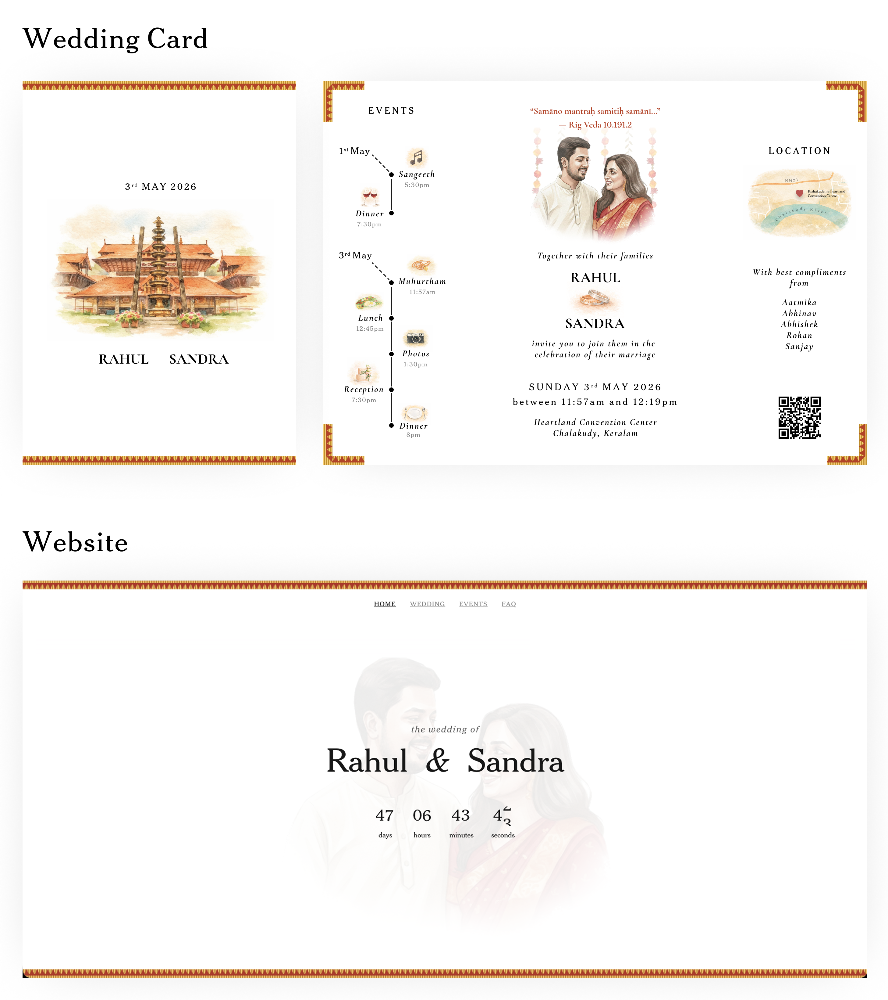
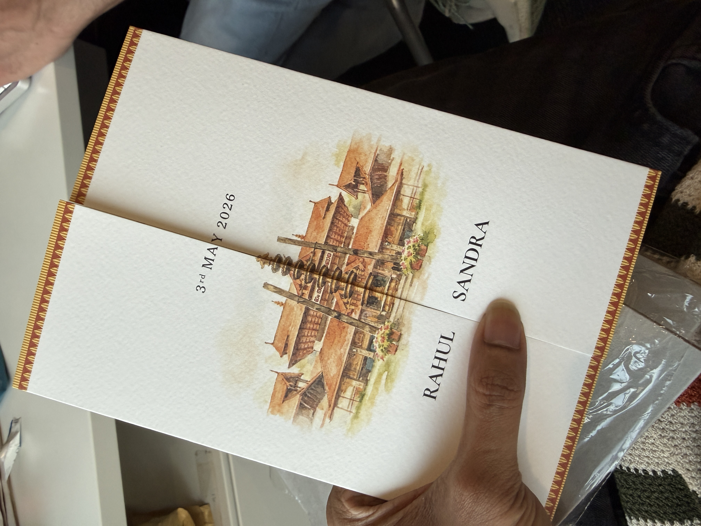
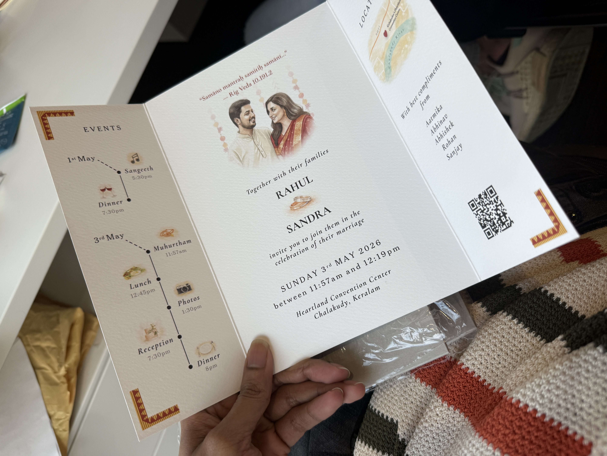

# Kerala Wedding Website + Wedding Card



A beautiful, animated wedding website and print-ready wedding card — at zero cost and zero coding knowledge required. The only expense is a custom domain, but you can just use the free Vercel domain too.

No coding experience? No problem. Just set up an AI coding agent like [Claude Code](https://claude.ai/code), tell it what you want to change, and it'll walk you through everything — from customizing the content to deploying the site.

The design incorporates traditional Kerala kasavu (gold border) elements throughout, creating a coherent visual identity across the wedding card and website. Scanning the QR code on the card takes guests straight to the website — a seamless experience from print to screen.

I'm Rohan, and I created this for my brother Rahul and his wife Sandra's wedding. Feel free to fork it and make it your own.

Live website: [sandraandrahul.com](https://sandraandrahul.com)

Built with Next.js, Tailwind CSS, and GSAP.

## What's Included

- **Website** — animated, responsive wedding website (this repo)
- **Wedding Card** — print-ready A5 wedding card designed in Figma ([open in Figma](https://www.figma.com/design/LBlEwmEGPJTh9Vu74BwkJO/Kerala-Wedding-Card?node-id=0-1&p=f&t=Im9vjmnopLF65e59-0))

## Features

- Watercolor paint-reveal hero animation (GSAP + Canvas)
- Countdown timer with rolling digits
- Animated Kerala-style gold kasavu border pattern
- Event timeline with draw-in animations
- Food menu modals for each event
- Calendar integration (Apple Calendar + Google Calendar)
- FAQ page with travel, accommodation, and dress code info
- Confetti celebration when the countdown hits zero
- Fully responsive

## Quick Start

```bash
git clone https://github.com/rohanharikr/kerala-wedding-website.git
cd kerala-wedding-website
npm install
npm run dev
```

Open [http://localhost:3000](http://localhost:3000) to see it. Deploy for free on [Vercel](https://vercel.com).

## Wedding Card

The wedding card is a print-ready A5 design available as a Figma file:

[Open in Figma](https://www.figma.com/design/LBlEwmEGPJTh9Vu74BwkJO/Kerala-Wedding-Card?node-id=0-1&p=f&t=Im9vjmnopLF65e59-0)

Here's how ours turned out in print:

<p>
  
  
</p>

> **Note:** In the second photo, the outer border was printed incorrectly — that was a mistake on our end. The Figma design has since been updated so this shouldn't happen again.

Fonts used (both open source):
- [Cormorant Garamond](https://fonts.google.com/specimen/Cormorant+Garamond)
- [Cheltenham Classic](https://github.com/vetrivelcsamy/cheltenham-classic)

## Creating the Watercolor Art

The watercolor-style venue artwork was generated using ChatGPT or Gemini AI. You can create your own using this prompt:

> I'm attaching two images. The first image is a real photo of the venue where my wedding is going to take place. I want the venue rendered in the same watercolor style — hand-drawn, washed-out — as the second reference image.

- **Image 1:** Attach a photo of your venue
- **Image 2:** Use the reference image included in the `reference/` folder (`watercolor-reference.png`)

## Support

If you found the wedding card design, artwork workflow, or website template helpful, please consider supporting Rahul & Sandra as they start their new journey together.

[](https://www.buymeacoffee.com/uw1ex9o)

## License

MIT
